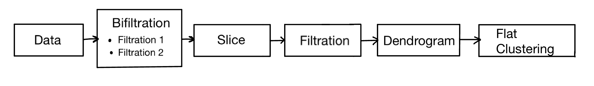

# ModernClusteringMethods
This repository contains code for a TDA algorithm, which uses filtration functions to capture data properties.

# Algorithm comparison
In ComparisonSynthetic.ipynb description and TDA interpretation of existing algorithms (ToMAto, HDBSCAN, Genie, DeBacl, Persistable) is provided.

# Developed algorithm
Code for the algorithm itself and its applications to generated datasets can be found in TDAclustering.ipynb file. \
Application pipeline is the following: \

1) Pass data points from $R^n$ as input
2) Create bifiltration - subsequence of subcomplexes based on data (on 2 filtration functions)
3) Take slice or path, which takes as input bifiltration and slice parameters and returns filtration function
4) Extract single filtration function by traversing the slice
5) Build dendrogram to decide on threshold parameter
6) Extract flat clustering
